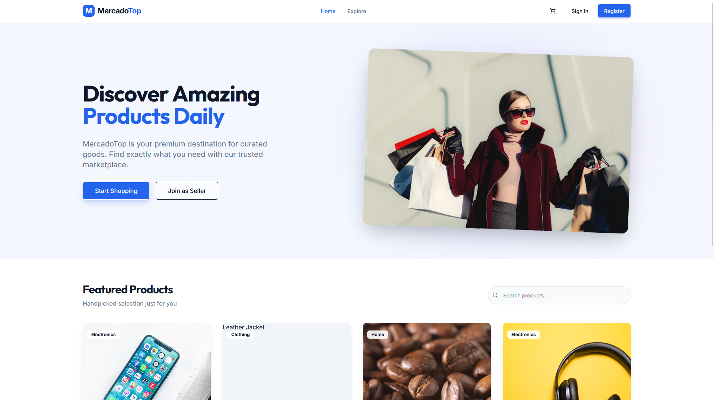
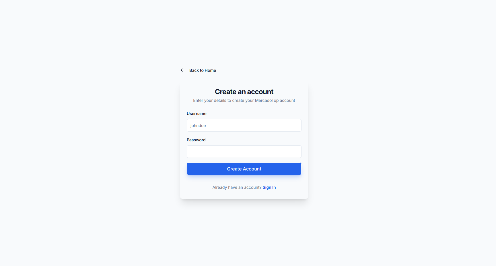
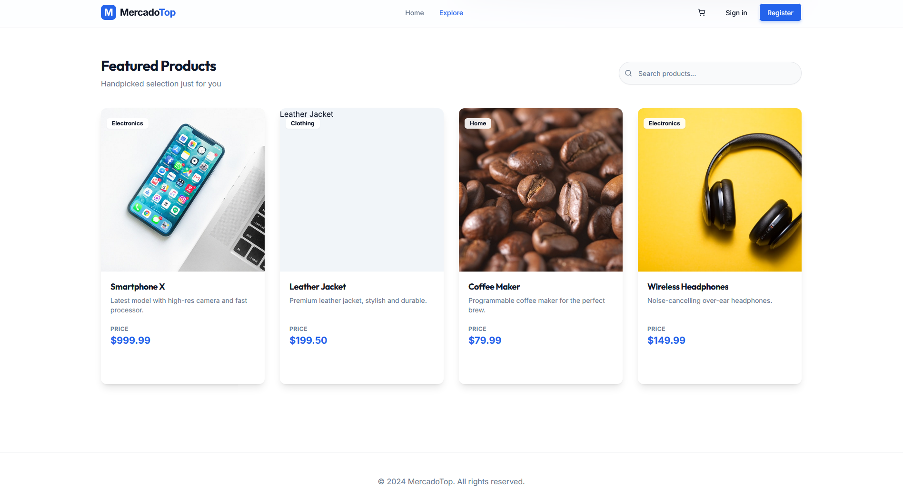

# Marketplace — Fullstack Application (Vite + Express)

This project is a **fullstack application** organized as a **monorepo**, containing both frontend and backend in a single repository.

The frontend is built with **Vite + React**, while the backend uses **Node.js with Express**.  
The project was developed as a practical experiment to build a real application and to evaluate the use of **AI-assisted development (Replit AI)** as a supporting tool — with all critical logic, architecture, and decisions implemented and reviewed manually.

---

## Application Screenshots

> Below are some screenshots of the application running locally.

<p align="center">
  
</p>

<p align="center">
  
</p>

<p align="center">
  
</p>

> Screenshots are located in: `assets/`

---

## Project Overview

The main goals of this project were:

- Build a functional fullstack application using modern JavaScript tools
- Practice backend and frontend integration in a monorepo structure
- Experiment with AI as a **development aid**, not as a replacement
- Maintain clean architecture, readable code, and explicit decision-making

---

## Tech Stack

### Frontend (`/client`)
- React
- Vite
- TypeScript
- Tailwind CSS
- Component-based architecture
- API consumption via HTTP

### Backend (`/server`)
- Node.js
- Express
- TypeScript
- REST API
- Authentication utilities
- File storage and static handling

### Shared
- Shared schemas and routes
- Type reuse between frontend and backend

---

## Project Structure

```text
MARKETPLACE/
├── client/          # Frontend (Vite + React)
├── server/          # Backend (Express API)
├── shared/          # Shared types, schemas and routes
├── assets/
│   └── screenshots/ # Application screenshots used in README
├── README.md
└── package.json
